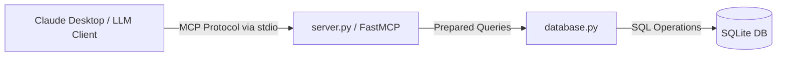

# Employee Database MCP Server

An MCP (Model Context Protocol) server built with **FastMCP** and **SQLite** that enables AI clients (such as Claude Desktop and Cursor) to query, analyze, and update structured employee records using natural language.

---

## 🏗️ Architecture



---

## ✨ Features & Exposed MCP Tools

The server exposes parameterized, injection-safe database functions directly to LLM clients:

| Category | MCP Tool Name | Description |
| :--- | :--- | :--- |
| **Lookup & Search** | `get_employee_by_id`, `search_employees_by_name`, `list_employees` | Fetch individual records or query by name/pattern. |
| **Data Operations** | `add_employee`, `update_employee_salary`, `remove_employee` | Perform CRUD mutations with input validation. |
| **Analytics & Metrics**| `get_highest_paid_employee`, `calculate_average_salary`, `get_company_stats` | Aggregate salaries and generate company-wide statistics. |
| **Department Info** | `list_departments`, `count_employees_by_department` | Group and summarize workforce distribution. |

---

## 🛠️ Tech Stack

* **Language:** Python 3.10+
* **Database:** SQLite
* **Protocol:** Model Context Protocol (MCP / FastMCP)
* **Testing:** pytest (11 unit tests covering database transactions and queries)

---

## 🚀 Quickstart & Setup

### 1. Installation
Clone the repository and install dependencies:

```bash
git clone [https://github.com/JacobW2000/sqlite-mcp-server.git](https://github.com/JacobW2000/sqlite-mcp-server.git)
cd sqlite-mcp-server
python -m venv venv

# On Windows:
.\venv\Scripts\activate

# On macOS/Linux:
# source venv/bin/activate

pip install -r requirements.txt
```

### 2. Integration with Claude Desktop
Add the server configuration to your `claude_desktop_config.json`:

* **Windows:** `%APPDATA%\Claude\claude_desktop_config.json`
* **macOS:** `~/Library/Application Support/Claude/claude_desktop_config.json`

```json
{
  "mcpServers": {
    "employee-database": {
      "command": "python",
      "args": [
        "C:/path/to/sqlite-mcp-server/server.py"
      ]
    }
  }
}
```

---

## 🧪 Testing

This project includes 11 automated pytest tests covering database operations, transaction safety, and employee queries:

```bash
python -m pytest tests/test_database.py
```